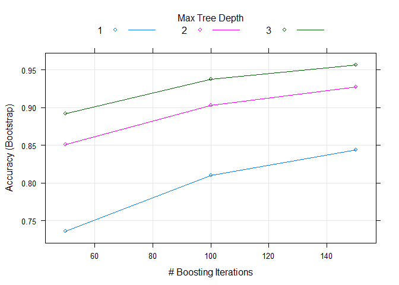
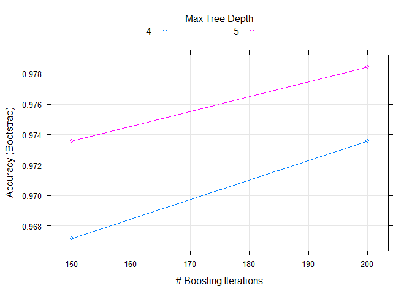

Human Activity Recognition
================

Background
----------

Using devices such as Jawbone Up, Nike FuelBand, and Fitbit it is now possible to collect a large amount of data about personal activity relatively inexpensively. These type of devices are part of the quantified self movement - a group of enthusiasts who take measurements about themselves regularly to improve their health, to find patterns in their behavior, or because they are tech geeks. One thing that people regularly do is quantify how much of a particular activity they do, but they rarely quantify how well they do it. In this project, your goal will be to use data from accelerometers on the belt, forearm, arm, and dumbell of 6 participants. They were asked to perform barbell lifts correctly and incorrectly in 5 different ways. More information is available from the website here: <http://groupware.les.inf.puc-rio.br/har> (see the section on the Weight Lifting Exercise Dataset).

Data
----

The training data for this project are available here:

<https://d396qusza40orc.cloudfront.net/predmachlearn/pml-training.csv>

The test data are available here:

<https://d396qusza40orc.cloudfront.net/predmachlearn/pml-testing.csv>

The data for this project come from this source: <http://groupware.les.inf.puc-rio.br/har>. I would like to thanks for the data to make this report and by their generous contibution to data science students.

Reading Data
------------

We start setting the column information while reading to improve the speed and make less work in tranformation and cleaning in the following steps. The following study requires the following libraries: data.table, caret, Amelia, dplyr and lubridate. The assignment and class definition for data can be found in Apendix A.

Cleaning Data
-------------

First we must check for missing data, lets plot it:

``` r
#cleaning
     par(mar = c(2,1,3,1))
     missmap(raw.training, x.cex = 0.5, main = "Missing data in columns")
```


Almost half of the columns has more than 95% of missing data and the columns with complete data, they have 0% NA's so we will not use the columns with missing data and find out if the remain columns let us made a good prediction.

After defining factor class for variables of interest we find columns that are not classified as NA's but, the only have empty character values(""), "0.00"" and "\#DIV/0!" so we also discard those columns, and the last cleaning procedure include removing the first 7 colums that include general information about data, like names, dates and the index.

Finally we create a train and test set with 75% data for training and 25% for testing.

``` r
     raw.training <- raw.training[colSums(!is.na(raw.training))/nrow(raw.training)==1]
     raw.testing <- raw.testing[colSums(!is.na(raw.testing))/nrow(raw.testing)==1]
     
     #eliminate kurtosis, skewness, max_yaw, min_yaw and amplitud_yaw
     raw.training <- raw.training[, sapply(raw.training, class) != "character"]
     raw.testing <- raw.testing[, sapply(raw.testing, class) != "character"]
     
     #remove first  7 cols (characteristics)
     raw.training <<- raw.training[,8:ncol(raw.training)]
     raw.testing <<- raw.testing[,8:ncol(raw.testing)]
     
     #create train and testing set
     inTrain <- createDataPartition(raw.training$classe, p = 0.75, list = F)
     dat.train <<- raw.training[inTrain,]
     dat.test <<- raw.training[-inTrain,]
```

To improve the speed of the model and to remove data that may cause bias or high variance because of overfitting with to many predictors we make the following pre-process.

1.  Check for values with high frecuency and low unique values using function nearZeroVar.
2.  Removing predictors with high correlation, we choose 0.9 as the filter (using function cor and finCorrelation)

``` r
     #valores con alta frecuencia o pocos valores únicos - la funcion + 
     #descarta las columnas que tienen estas 2 condiciones
     nearZeroVar(dat.train)
```

    ## integer(0)

``` r
     #alta correlacion entre las variables también causa inestabilidad
     # y la selección de cual variable usar se vuelve aleatoria
     cormat <- cor(dat.train[,-ncol(dat.train)])
     highCorr <- findCorrelation(cormat, 0.9)
     dat.train <<- dat.train[,-highCorr]
     dat.test <<- dat.test[,-highCorr]
```

Modeling
--------

Because we have our data cleaned and ready we procced to try different models and test them with out testing data.

1.  First we try a bagging model of random forests with default parameters and get the following accuracy and expected errors.

``` r
set.seed(88)

     #default params
     fit1 <- train(classe~., method = "gbm", data = dat.train, verbose = FALSE)
```

    ## Loading required package: gbm

    ## Loading required package: survival

    ## 
    ## Attaching package: 'survival'

    ## The following object is masked from 'package:caret':
    ## 
    ##     cluster

    ## Loading required package: splines

    ## Loading required package: parallel

    ## Loaded gbm 2.1.1

    ## Loading required package: plyr

    ## -------------------------------------------------------------------------

    ## You have loaded plyr after dplyr - this is likely to cause problems.
    ## If you need functions from both plyr and dplyr, please load plyr first, then dplyr:
    ## library(plyr); library(dplyr)

    ## -------------------------------------------------------------------------

    ## 
    ## Attaching package: 'plyr'

    ## The following object is masked from 'package:lubridate':
    ## 
    ##     here

    ## The following objects are masked from 'package:dplyr':
    ## 
    ##     arrange, count, desc, failwith, id, mutate, rename, summarise,
    ##     summarize

``` r
     pred1 <- predict(fit1, dat.test)
     errors1 <- confusionMatrix(pred1, dat.test$classe)
     print(errors1)
```

    ## Confusion Matrix and Statistics
    ## 
    ##           Reference
    ## Prediction    A    B    C    D    E
    ##          A 1380   31    0    1    3
    ##          B   10  885   34    2   12
    ##          C    4   31  803   21   11
    ##          D    1    0   16  769   14
    ##          E    0    2    2   11  861
    ## 
    ## Overall Statistics
    ##                                          
    ##                Accuracy : 0.958          
    ##                  95% CI : (0.952, 0.9634)
    ##     No Information Rate : 0.2845         
    ##     P-Value [Acc > NIR] : < 2.2e-16      
    ##                                          
    ##                   Kappa : 0.9468         
    ##  Mcnemar's Test P-Value : 0.000164       
    ## 
    ## Statistics by Class:
    ## 
    ##                      Class: A Class: B Class: C Class: D Class: E
    ## Sensitivity            0.9892   0.9326   0.9392   0.9565   0.9556
    ## Specificity            0.9900   0.9853   0.9835   0.9924   0.9963
    ## Pos Pred Value         0.9753   0.9385   0.9230   0.9613   0.9829
    ## Neg Pred Value         0.9957   0.9838   0.9871   0.9915   0.9901
    ## Prevalence             0.2845   0.1935   0.1743   0.1639   0.1837
    ## Detection Rate         0.2814   0.1805   0.1637   0.1568   0.1756
    ## Detection Prevalence   0.2885   0.1923   0.1774   0.1631   0.1786
    ## Balanced Accuracy      0.9896   0.9589   0.9613   0.9745   0.9759

Plotting our model we saw that improving the number of trees and the deep of those we can improve our prediction, so we try with 200 (not 150 default) and deep 4 and 5.

``` r
#better
set.seed(88)
     bootControl <- trainControl(number = 5)
     gbmgrid <- expand.grid(interaction.depth = c(4,5), n.trees = c(150,200), 
                            shrinkage = 0.1, n.minobsinnode = c(1))
     fit2 <- train(classe~., method = "gbm", data = dat.train ,
                   tuneGrid = gbmgrid,
                   trControl = bootControl, verbose = FALSE)
     pred2 <- predict(fit2, dat.test)
     errors2 <- confusionMatrix(pred2, dat.test$classe)
     print(errors2)
```

    ## Confusion Matrix and Statistics
    ## 
    ##           Reference
    ## Prediction    A    B    C    D    E
    ##          A 1391   11    0    0    0
    ##          B    4  925   12    1    5
    ##          C    0   11  831   13    4
    ##          D    0    1   11  785    6
    ##          E    0    1    1    5  886
    ## 
    ## Overall Statistics
    ##                                           
    ##                Accuracy : 0.9825          
    ##                  95% CI : (0.9784, 0.9859)
    ##     No Information Rate : 0.2845          
    ##     P-Value [Acc > NIR] : < 2.2e-16       
    ##                                           
    ##                   Kappa : 0.9778          
    ##  Mcnemar's Test P-Value : NA              
    ## 
    ## Statistics by Class:
    ## 
    ##                      Class: A Class: B Class: C Class: D Class: E
    ## Sensitivity            0.9971   0.9747   0.9719   0.9764   0.9834
    ## Specificity            0.9969   0.9944   0.9931   0.9956   0.9983
    ## Pos Pred Value         0.9922   0.9768   0.9674   0.9776   0.9922
    ## Neg Pred Value         0.9989   0.9939   0.9941   0.9954   0.9963
    ## Prevalence             0.2845   0.1935   0.1743   0.1639   0.1837
    ## Detection Rate         0.2836   0.1886   0.1695   0.1601   0.1807
    ## Detection Prevalence   0.2859   0.1931   0.1752   0.1637   0.1821
    ## Balanced Accuracy      0.9970   0.9846   0.9825   0.9860   0.9908

RESULTS
-------

Using a bagging model we achieve an overall accuracy of 98% and 99% for our class type A, wich correspond to the exercise being made correctly. Improved from 95% with default parameters to 99% incresing the trees depth and the number of iterations.

``` r
plot(fit1)
```



``` r
plot(fit2)
```



Apendix A
---------

     setAs("character","fullDate", function(from) dmy_hm(from))
     setClass('fullDate')
     
     col.type.train <- c(user_name = "factor",
                      classe = "factor",
                      cvtd_timestamp = "fullDate",
                      new_window = "factor")
     raw.training <- read.csv("pml-training.csv", colClasses = col.type.train, 
                              header = T, 
                           stringsAsFactors = F)

     col.type.test <- c(user_name = "factor",
                         cvtd_timestamp = "fullDate",
                         new_window = "factor")
     raw.testing <<- read.csv("pml-testing.csv", colClasses = col.type.test, 
                              header = T, 
                              stringsAsFactors = F)
